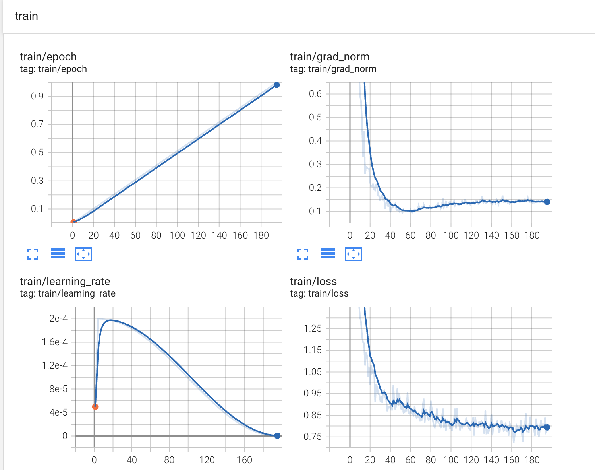

# Hyper-Sloth

A high-performance framework for fine-tuning large language models.

## Performance Benchmarks

Hyper-Sloth demonstrates significant performance improvements over other popular fine-tuning frameworks.

### Training Time Comparison (4x RTX 4090)

```python
from HyperSloth.hypersloth_config import *

# Main configuration using Pydantic models
hyper_config_model = HyperConfig(
    grad_dir="/dev/shm/hypersloth",
    data=DataConfig(
        dataset_name_or_path="../localization/data/sharegpt/train_50k.json",
        test_ratio=0.05,
        dataset_num_proc=16,
    ),
    training=TrainingConfig(
        gpus=range(1),
        loss_type="all",
        
    ),
    fast_model_args=FastModelArgs(
        model_name="/mnt/data/huggingface-models/ModelSpace/GemmaX2-28-2B-v0.1",
        max_seq_length=2048,
    ),
    lora_args=LoraArgs(
        r=16,
        lora_alpha=16,
    ),
)

# Training arguments using Pydantic model
training_config_model = TrainingArgsConfig(
    output_dir="outputs/2B/",
    per_device_train_batch_size=4,
    learning_rate=0.0002,
    gradient_accumulation_steps=16,
    per_device_eval_batch_size=2,
    eval_steps=100,
    logging_steps=1,
    report_to="tensorboard",
    num_train_epochs=1,
    lr_scheduler_type="linear",
    warmup_steps=5,
    seed=42,
    save_total_limit=2,
    bf16=True,
    fp16=False,
    optim="adamw_8bit",
    weight_decay=0.01,
    packing=False,
)

```


| Framework    | Training Time | VRAM Peak Consumption |
|--------------|---------------|----------------------|
| Hyper-Sloth  | 19 minutes    | 6 GB               |
| LlamaFactory | 30 minutes    | 21GB                 |
| Unsloth (1X) | ~70 minutes   | 6 GB               |

### Loss Curves

The loss scale between Hyper-Sloth and LlamaFactory looks comparable, indicating similar training quality with significantly improved training speed.




## Configuration

Hyper-Sloth uses Pydantic models for configuration. See `hypersloth_config.py` for an example configuration.

## Getting Started

[Configuration instructions and usage examples will go here]
# HyperSloth: Efficient Multi-GPU Training for LLMs

<p align="center">
    
</p>

## Overview

HyperSloth=Unsloth+Multi-GPUS

## Features

- **Memory-mapped gradient synchronization**: Coordinate training across multiple GPUs without requiring NCCL/DDP
- **Customizable loss types**: Support for full sequence or response-only training

## Installation

```bash
# Clone the repository
pip install git+https://github.com/anhvth/HyperSloth.git

```

## Quick Start

### Train a model across multiple GPUs

```bash
# Start training on GPUs 0 and 1
CUDA_VISIBLE_DEVICES=0,1,2,3 hypersloth\
    --model_name "unsloth/DeepSeek-R1-Distill-Qwen-7B-unsloth-bnb-4bit" \
    --file "./data/cod_6k5.json" \
    --max_seq_length 2048 \
    --per_device_train_batch_size 1 \
    --gradient_accumulation_steps 16 \
    --learning_rate 2e-4 \
    --loss_type target_only
```

### Command Line Arguments

| Argument | Description |
|----------|-------------|
| `--file` | Path to the training data file (ShareGPT format) |
| `--model_name` | Pret# HyperSloth: Efficient Multi-GPU Training for LLMs


## Overview

HyperSloth is an extension of Unsloth for distributed training of Large Language Models across multiple GPUs. It focuses on efficient gradient synchronization using memory-mapped files for seamless communication between GPU processes.

## Features

- **Memory-mapped gradient synchronization**: Coordinate training across multiple GPUs without requiring NCCL/DDP
- **Efficient weight synchronization**: Ensure model consistency across all GPUs during training
- **Template fixes**: Custom tokenizer chat template fixes for proper handling of "think" tags
- **Customizable loss types**: Support for full sequence or response-only training

## Installation

```bash
pip install git+https://github.com/anhvth/hypersloth
```

## Quick Start

### Train a model across multiple GPUs

```bash
# Start training on GPUs 0 and 1
CUDA_VISIBLE_DEVICES=0,1 hypersloth \
    --model_name "unsloth/DeepSeek-R1-Distill-Qwen-7B-unsloth-bnb-4bit" \
    --file "./data/cod_6k5.json" \
    --max_seq_length 2048 \
    --per_device_train_batch_size 1 \
    --gradient_accumulation_steps 16 \
    --learning_rate 2e-4 \
    --loss_type target_only
```

### Help
```bash
[>training| ~/projects/unsloth-trainer-multi-gpus ] export CUDA_VISIBLE_DEVICES=0,1,2,3,4,5,6,7
[>training| ~/projects/unsloth-trainer-multi-gpus, 130 ] hypersloth  --help
usage: hypersloth [-h] [--file FILE] [--packing] [--model_name MODEL_NAME] [--test_ratio TEST_RATIO] [--gradient_accumulation_steps GRADIENT_ACCUMULATION_STEPS] [--max_seq_length MAX_SEQ_LENGTH]
                  [--per_device_train_batch_size PER_DEVICE_TRAIN_BATCH_SIZE] [--logging_steps LOGGING_STEPS] [--eval_steps EVAL_STEPS] [--warmup_steps WARMUP_STEPS] [--num_train_epochs NUM_TRAIN_EPOCHS]
                  [--learning_rate LEARNING_RATE] [--not_bf16] [--loss_type {all,target_only}] [--optim OPTIM] [--weight_decay WEIGHT_DECAY] [--lr_scheduler_type LR_SCHEDULER_TYPE] [--seed SEED]
                  [--output_dir OUTPUT_DIR] [--save_total_limit SAVE_TOTAL_LIMIT] [--report_to REPORT_TO] [--grad_dir GRAD_DIR]

Training script for multi-GPU setup.

options:
  -h, --help            show this help message and exit
  --file FILE           Path to the data file.
  --packing             Enable packing.
  --model_name MODEL_NAME
                        Name of the model to use.
  --test_ratio TEST_RATIO
                        Ratio of the test set.
  --gradient_accumulation_steps GRADIENT_ACCUMULATION_STEPS
                        Number of gradient accumulation steps.
  --max_seq_length MAX_SEQ_LENGTH, -l MAX_SEQ_LENGTH
                        Maximum sequence length.
  --per_device_train_batch_size PER_DEVICE_TRAIN_BATCH_SIZE, -b PER_DEVICE_TRAIN_BATCH_SIZE
                        Batch size per device during training.
  --logging_steps LOGGING_STEPS
                        Log every X updates steps.
  --eval_steps EVAL_STEPS
                        Run an evaluation every X steps.
  --warmup_steps WARMUP_STEPS
                        Number of steps to perform learning rate warmup.
  --num_train_epochs NUM_TRAIN_EPOCHS, -e NUM_TRAIN_EPOCHS
                        Total number of training epochs to perform.
  --learning_rate LEARNING_RATE, -lr LEARNING_RATE
                        Initial learning rate for Adam.
  --not_bf16            Whether to use 16-bit (mixed) precision training.
  --loss_type {all,target_only}
                        Whether to use 16-bit (mixed) precision training.
  --optim OPTIM         Optimizer to use.
  --weight_decay WEIGHT_DECAY
                        Weight decay to use.
  --lr_scheduler_type LR_SCHEDULER_TYPE
                        The scheduler type to use.
  --seed SEED           Random seed for initialization.
  --output_dir OUTPUT_DIR
                        The output directory for the model training.
  --save_total_limit SAVE_TOTAL_LIMIT
                        Limit the total amount of checkpoints.
  --report_to REPORT_TO
                        The list of integrations to report the results and logs to.
  --grad_dir GRAD_DIR   The directory to store the gradients.
```

# Hyper-Sloth

A high-performance framework for fine-tuning large language models.

## Performance Benchmarks

Hyper-Sloth demonstrates significant performance improvements over other popular fine-tuning frameworks.

### Training Time Comparison (4x RTX 4090)

| Framework    | Training Time |
|--------------|--------------|
| Hyper-Sloth  | 21 minutes   |
| LlamaFactory | 32 minutes   |
| Unsloth (1GPU) | 73 minutes  |

### Loss Curves

The loss scale between Hyper-Sloth and LlamaFactory looks comparable, indicating similar training quality with significantly improved training speed.


## Configuration

Hyper-Sloth uses Pydantic models for configuration. See `hypersloth_config.py` for an example configuration.

## Getting Started

[Configuration instructions and usage examples will go here]

